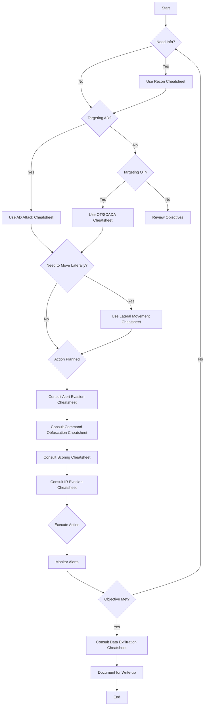

# StealthCup 2025: Operation Chemageddon - Cheatsheet Collection

Welcome to the cheatsheet collection for the StealthCup 2025 competition. This collection is designed to help your team navigate the challenges, achieve objectives, and most importantly, minimize detection to achieve the lowest possible score.

## Competition Overview

- **Scenario**: Infiltrate PlumeTech as the "Black Nimbus" hacker group.
- **Goal**: Achieve objectives while minimizing security alerts. Lowest score wins.
- **Network**: Target range `10.0.x.0/24` (where `x` is your team ID).
- **Access**: Via a Kali box implant in the client network (SSH on port `2020 + <team_id>`).

## Objectives

1.  **Enterprise Cup**: Create a user named `plumber` with **domain admin rights**.
2.  **OT Cup**: Leak chemicals by bringing the PLC into an **unsafe state** (set the `PORV` flag).

## Scoring System Quick Reference

- **Penalty Points**: Triggered alerts add points.
- **Severity Weights**: Critical > High > Medium > Low (Specific weights differ for Wazuh vs. Suricata).
- **Reset Multiplier**: Each infrastructure reset increases a score multiplier (`score * reset_multiplier`).
- **Validation**: Scores must be validated with a write-up explaining evasion techniques.

## Cheatsheet Index

Navigate through the specialized cheatsheets below for detailed techniques and tools:

1.  **[Reconnaissance Cheatsheet](Reconnaissance-Cheatsheet.md)**: Stealthy information gathering.
2.  **[AD Attack Cheatsheet](AD-Attack-Cheatsheet.md)**: Techniques for the Enterprise Cup objective.
3.  **[OT/SCADA Cheatsheet](OT-SCADA-Cheatsheet.md)**: Techniques for the OT Cup objective.
4.  **[Alert Evasion Cheatsheet](Alert-Evasion-Cheatsheet.md)**: Core strategies for minimizing detection.
5.  **[Command Obfuscation Cheatsheet](Command-Obfuscation-Cheatsheet.md)**: Hiding your commands and activities.
6.  **[Lateral Movement Cheatsheet](Lateral-Movement-Cheatsheet.md)**: Moving through the network undetected.
7.  **[Data Exfiltration Cheatsheet](Data-Exfiltration-Cheatsheet.md)**: Securely transferring data off the target network.
8.  **[Scoring System & Optimization Cheatsheet](Scoring-System-Cheatsheet.md)**: Understanding and optimizing your score.
9.  **[Incident Response Evasion Cheatsheet](Incident-Response-Evasion-Cheatsheet.md)**: Techniques to evade incident response activities.

## Infrastructure Overview

The competition environment includes:

- **Windows 2022 Servers**: Multiple servers running Active Directory and other services
- **Ubuntu 22.04 Servers**: Linux servers with various roles
- **Active Directory**: Multiple domains with trust relationships
- **OT Components**:
  - Open-source SCADA/HMI solution
  - Open-source Historian solution
  - Phoenix Contact PLC
- **Security Systems**:
  - Open-source NIDS (likely Suricata)
  - Open-source HIDS/SIEM (likely Wazuh)
  - Commercial EDR solution (detect-only mode)
- **Network Segmentation**: Firewalls between subnets

## General Strategy Decision Tree

## Attack Phases and Cheatsheet Mapping

| Attack Phase | Primary Cheatsheets | Secondary Cheatsheets |
|--------------|---------------------|------------------------|
| Initial Access | Reconnaissance | Alert Evasion, Command Obfuscation |
| Privilege Escalation | AD Attack, OT/SCADA | Command Obfuscation, Scoring System |
| Lateral Movement | Lateral Movement | Alert Evasion, IR Evasion |
| Objective Execution | AD Attack, OT/SCADA | Scoring System, IR Evasion, Data Exfiltration |
| Persistence | Lateral Movement | IR Evasion, Command Obfuscation |
| Data Collection & Exfiltration | Data Exfiltration | Alert Evasion, Scoring System |
| Persistence | Lateral Movement | IR Evasion, Command Obfuscation |

## Key Rules Reminders

- **Do not** attack any networks outside `10.0.x.0/24` or the management network `10.0.0.242.0/24`
- **Do not** overflow, overload, or DoS the detection components
- **Do not** delete any log files or command history
- **Do not** block or stop any network services
- **Do not** restart any machines

Good luck, and stay stealthy!