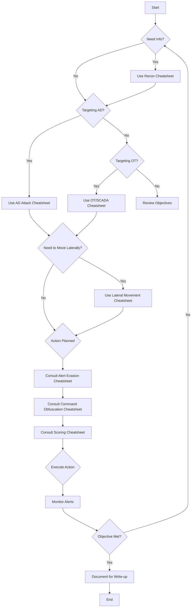

# StealthCup 2025: Operation Chemageddon - Cheatsheet Collection

Welcome to the cheatsheet collection for the StealthCup 2025 competition. This collection is designed to help your team navigate the challenges, achieve objectives, and most importantly, minimize detection to achieve the lowest possible score.

## Competition Overview

- **Scenario**: Infiltrate PlumeTech as the "Black Nimbus" hacker group.
- **Goal**: Achieve objectives while minimizing security alerts. Lowest score wins.
- **Network**: Target range `10.0.x.0/24` (where `x` is your team ID).
- **Access**: Via a Kali box implant in the client network (SSH on port `2020 + <team_id>`).

## Objectives

1.  **Enterprise Cup**: Create a user named `plumber` with **domain admin rights**.
2.  **OT Cup**: Leak chemicals by bringing the PLC into an **unsafe state** (set the `PORV` flag).

## Scoring System Quick Reference

- **Penalty Points**: Triggered alerts add points.
- **Severity Weights**: Critical > High > Medium > Low (Specific weights differ for Wazuh vs. Suricata).
- **Reset Multiplier**: Each infrastructure reset increases a score multiplier (`score * reset_multiplier`).
- **Validation**: Scores must be validated with a write-up explaining evasion techniques.

## Cheatsheet Index

Navigate through the specialized cheatsheets below for detailed techniques and tools:

1.  **[Reconnaissance Cheatsheet](Reconnaissance-Cheatsheet.md)**: Stealthy information gathering.
2.  **[AD Attack Cheatsheet](AD-Attack-Cheatsheet.md)**: Techniques for the Enterprise Cup objective.
3.  **[OT/SCADA Cheatsheet](OT-SCADA-Cheatsheet.md)**: Techniques for the OT Cup objective.
4.  **[Alert Evasion Cheatsheet](Alert-Evasion-Cheatsheet.md)**: Core strategies for minimizing detection.
5.  **[Command Obfuscation Cheatsheet](Command-Obfuscation-Cheatsheet.md)**: Hiding your commands and activities.
6.  **[Lateral Movement Cheatsheet](Lateral-Movement-Cheatsheet.md)**: Moving through the network undetected.
7.  **[Scoring System & Optimization Cheatsheet](Scoring-System-Cheatsheet.md)**: Understanding and optimizing your score.

## General Strategy Decision Tree

Good luck, and stay stealthy!